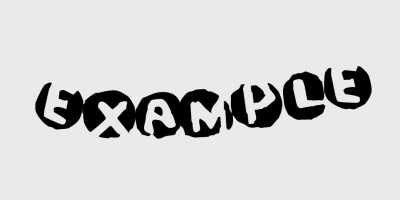
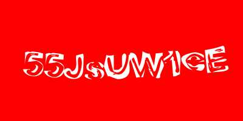

RealCaptcha
=====================

A PHP Library that uses the [PHP-GD](http://php.net/manual/en/book.image.php) Extension to generate Captchas with only PHP.  
RealCaptcha is released under the [MIT License](http://projects.dichrome.tk/realCaptcha/license.php). Visit the project [Homepage](http://projects.dichrome.tk/realCaptcha/) for more information.

**Note:** This code is still in its Beta stage so it maybe prone to many bugs...  
**Note:** The Fonts included here are not created or owned by the author of the code,
but none the less, their liscenses are open-source, commercial-friendly and permit redistribution, [Check them out](#fonts) yourself.




##Features

+ Custom Fonts
+ Customizable Colors
+ Supports 4 different captcha text sources

    + __Input__<br>

    + __Custom Generator Functions__<br> You can define a custom function of your own that generates the text that should be in the captcha.<br>

    + __Random Text Generator__<br> Generates a random string of Letters and Numbers.<br>

    + __Dictionary File__<br> Can use any file containing space separated words as a dictionary file to choose words from.

+ Captcha Image Compression
+ 3 different output formats ( **jpg**, **png**, **gif** )
+ Output locations
    + To Browser
    + To File
    + Return GD Resource Handle

##Installation
The simplest method is using [Composer](https://getcomposer.org). Just require it in your `composer.json` file as such:
```json
{
    "require":{
        "omran-jamal/real-captcha":"dev-master"
    }
}
```
To incluude it in your project, include the composer autoloader and just create new objects of the `RealCaptcha` class under the `RealCaptcha` namespace as such:
```php
include 'vendor/autoload.php';
$captcha = new RealCaptcha\RealCaptcha();
```

Alternatively you could manually clone or download this reppository and directly include the Class file in and create an object of `RealCaptcha\RealCaptcha`

Basic Usage
---------------------------
###Basic
```php
$captcha = new RealCaptcha\RealCaptcha();
$captcha->generate()->output("jpg");
```

###Configuring
All three of these code output similar Captchas to the browser in JPG Format.  

While Initializing
```php
$realCaptcha = new RealCaptcha\RealCaptcha(array(
    "height" = 200,
    "width" = 500,
    "number_of_words" = 2
));

$captcha = $realCaptcha->generate();
$captcha->output("jpg");
```
The Settings you provide at Initialzation will be used everytime the `generate()` method is called.  

Using the ***`set()`*** method
```php
$realCaptcha = new RealCaptcha\RealCaptcha();

$realCaptcha->set(array(
    "height" = 200,
    "width" = 500,
    "number_of_words" = 2
));

$captcha = $realCaptcha->generate();
$captcha->output("jpg");
```
The settings you define with the `set()` method will overwrite the settings you provided at initialization and will be used
every time the `generate()` method is called.  

While Generating

```php
$realCaptcha = new RealCaptcha\RealCaptcha();

$captcha = $realCaptcha->generate(array(
    "height" = 200,
    "width" = 500,
    "number_of_words" = 2
));
$captcha->output("jpg");
```
The `generate()` method will give high priority to the settings passed to it as an argument. These setting will be forgotten
as soon as the captcha is finished generating.

###Dealing with output
```php
$realCaptcha = new RealCaptcha\RealCaptcha();
$captcha = $realCaptcha->generate();
```
The `generate()` method returns an Output object it has two methods and a buch of Properties.

####The Methods
+ `file( path, format, quality)`: Writes Captcha to a file
+ `output( format, quality)`: Sets appropriate image format headers and sends the Image data to browser

####The Properties
+ `text`: Contains a string words that are present in the captcha image, seperated by spaces
+ `array`: Contains an Array of the words present in the captcha image.

####Example
This example generates a captcha and stores the captcha text  in a session variable so that it can be 
matched later and output the captcha image to browser and also daves the image to a file named `example.jpg`
```php
session_start();
$realCaptcha = new RealCaptcha\RealCaptcha();

$captcha = $realCaptcha->generate();
$_SESSION["captcha_text"] = $captcha->text;
$captcha->output("jpg",100);
$captcha->file("example.jpg","jpg",100);
```

###Saving Captcha to file
To save captcha to file, you can use the **`file( file_path, format, quality)`** method.
```php
$captcha = $realCaptcha->generate();
$captcha->file("file.jpg" ,"jpg", 90);
```
Full List of settings
--------------------------------
+ **height** (a positive Integer) : Height of the generated Captcha Image.
+ **width** (a positive integer) : Width of the generated Captcha Image.
+ **source** (realCaptcha source type constant): Where to get the captcha text from.
    + **`RealCaptcha\RealCaptcha::INPUT`**: Requires you to pass the captcha text while calling `generate()` method
    + **`RealCaptcha\RealCaptcha::RANDOM`**: Generates a random string of letters and numbers.
    + **`RealCaptcha\RealCaptcha::DICTIONARY`**: Selects words at random from the dictionary file.
    + **`RealCaptcha\RealCaptcha::uFUNCTION`**: Requires you to set a custom made function that returns the captcha text.
+ **dictionary_file** (a valid file path): Path to the dictionary File.
+ **fonts_dir** (a valid directory path): Path to the dictory containing all the fonts.
+ **number_of_words** (a positive integer): Number of words the captcha image should contain.
+ **random_length** (a positive integer): the length of the randomly generated string.
+ **background_color** (realCaptcha variable_grey setting constant or array)
    + **`RealCaptcha\RealCaptcha::GREY_VARIABLE`** : Randomly chooses a shade from white to light ash.
    + **`array( int, int, int)`** : A numerical array containing RGB values.
+ **text_color** (array): A numerical array containing RGB values.


Advanced Usage
---------------------------
###Setting Background and Text color



```php
$captcha = new RealCaptcha\RealCaptcha(array(
    "background_color" => array(255,0,0), //Bright Red
    "text_color" => array(255,255,255) //White
));

$captcha->generate()->output("jpg");
```
###Using direct Input
Both these codes are correct but work in different ways and the settings persist 
for different fractions of the run cycle.

Setting at Initialization
```php
$captcha = new RealCaptcha\RealCaptcha(array(
    "source" => realCaptcha::INPUT
));

$captcha->generate("Text")->output("jpg");
```

Setting at Generator
```php
$captcha = new RealCaptcha\RealCaptcha();
$captcha->generate("Text", array("source" => realCaptcha::INPUT))->output("jpg");
```
It is Completely ok to pass String or an Array as input into the generator method,
thus both the following teo lines of code are valid
```php
$captcha->generate("Text")->output("jpg");
$captcha->generate(array("example","text"))->output("jpg");
```
###Using Custom Text Generator Function
Unlike __Direct Input__ , Custom Functions cannot be set and declared at the __generator__ method,
custom function usage has to be declared in the initialization settings or through the `set()` method
and the function has to be define through the `textFunction()` method as the first argument. All prior to 
calling the `generate()` method in which you intend to use the Custom function.


####Example
```php
$captcha = new RealCaptcha\RealCaptcha(array(
    "source" => realCaptcha::uFUNCTION
));

$captcha->textFunction(function(){
    return array("EXAMPLE","FUNCTION");
});

$captcha->generate()->output("jpg");
```

Fonts
---------
+ [swirled2](http://www.1001fonts.com/swirled-brk-font.html)
+ [Seraphim Font](http://www.1001fonts.com/seraphim-font.html)
+ [Potassium Scandal](http://www.1001fonts.com/potassium-scandal-font.html)
+ [RattyTatty](http://www.1001fonts.com/rattytatty-font.html)
+ [Quick End Jerk](http://www.fontsquirrel.com/fonts/Quick-End-Jerk)
+ [Zero & Zero Is](http://www.fontsquirrel.com/fonts/Zero-Zero-Is)
+ [Previewance](http://www.1001fonts.com/previewance-font.html)
+ [Playdough](http://www.1001fonts.com/playdough-font.html)
+ [Paper Cut](http://www.1001fonts.com/paper-cut-font.html)
+ [Nervous Rex](http://www.fontsquirrel.com/fonts/Nervous-Rex)
+ [Lilac Malaria](http://www.fontsquirrel.com/fonts/Lilac-Malaria)
+ [Eraser](http://www.fontsquirrel.com/fonts/Eraser)
+ [Edo](http://www.fontsquirrel.com/fonts/Edo)
+ [CarbonType](http://www.fontsquirrel.com/fonts/CarbonType)
+ [Boston Traffic](http://www.fontsquirrel.com/fonts/Boston-Traffic)
+ [1942 report](http://www.fontsquirrel.com/fonts/1942-report)


Liscense
---------
RealCaptcha is released under the [MIT License](LICENSE.txt). Visit the project [Homepage](http://omran-jamal.github.io/realCaptcha/) for more information.
